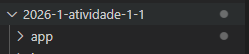
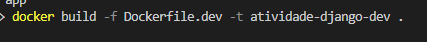
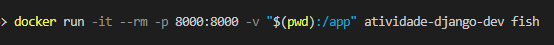
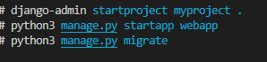
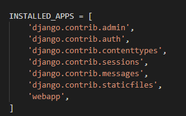
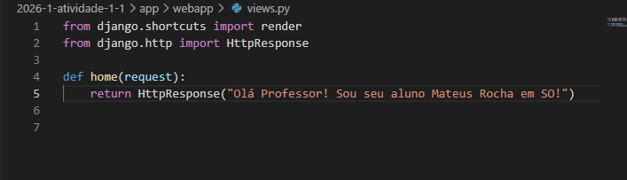
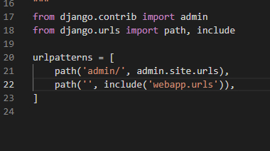
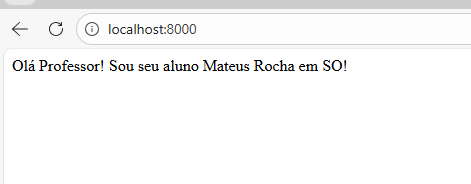
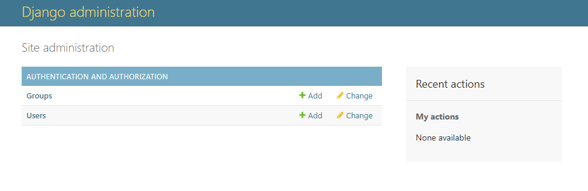

# Atividade 1.1 Avaliativa de 2026.1 - 1o Bimestre - Sistemas operacionais - Mateus Rocha Lucas da Silva

## Introdução:
A atividade consiste na criação, configuração e execução de uma aplicação Django dentro de uma imagem fedora disponibilizada pelo professor através de um repositório no Github.
## Relato das atividades:
Após adicionar o repositório disponibilizado a minha conta pessoal criei a pasta app e dentro dessa pasta criei o arquivo requiremets.txt: 

  

Criei um arquivo dockerfile.dev e construi e executei o container: 

  
  

Dentro do container criei o projeto Django, criei uma aplicação e adicionei essa aplicação ao settings.py, executei as migrações do banco de dados e criei :  

Criei uma view simples com o meu nome, configurei a URL da aplicação e executei o servidor e testei a aplicação pelos links: http://localhost:8000 , http://localhost:8000/admin:

## Considerações finais:
